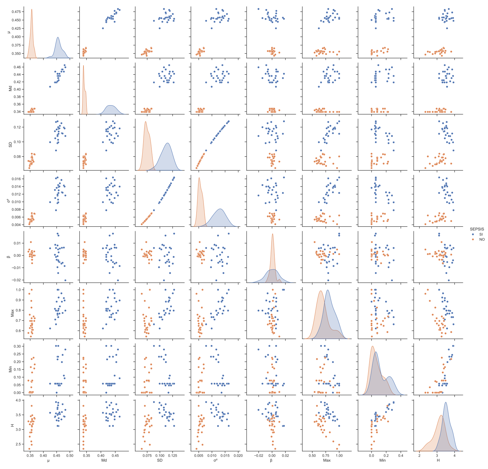

# 🧠 Sepsis Prediction Project

This repository contains the initial framework for a predictive model of sepsis based on biomedical signal analysis and machine learning. The main objective is to identify early physiological patterns associated with the onset of sepsis, providing computational support for timely medical intervention and improved patient outcomes.

Currently, the only publicly available file is `Features_sepsis.ipynb`, which includes the feature extraction, preprocessing, and feature space mapping processes used in the study. These stages form the foundation of the predictive pipeline and are essential for understanding the multidimensional relationships between biomedical variables and sepsis risk.

The prediction module, which implements Support Vector Machines (SVM) and Random Forest models, is currently under review for publication in a Q1 journal (BMJ Health & Care Informatics). Once the paper is officially published, the corresponding code for prediction and a detailed explanation of the employed methodologies will be made publicly available in this repository.

---

## 🔒 Data Availability
The datasets used in this research contain sensitive biomedical information and therefore cannot be shared publicly due to privacy, ethical, and regulatory constraints. All analyses were conducted under secure access protocols in compliance with research ethics and data protection standards.

---

## 📊 Model Overview
The models developed in this project achieved over 80% accuracy in predicting sepsis cases, highlighting the potential of machine learning to enhance diagnostic precision and risk stratification in clinical environments.  
Upon publication, further details will be provided regarding:
- Model training and validation procedures  
- Hyperparameter optimization  
- Evaluation metrics  
- Statistical interpretation of the results

  

---

## 🧩 Repository Contents
| File | Description |
|------|--------------|
| `Features_sepsis.ipynb` | Notebook containing data preprocessing, feature extraction, and feature space mapping used for the sepsis prediction framework. |
